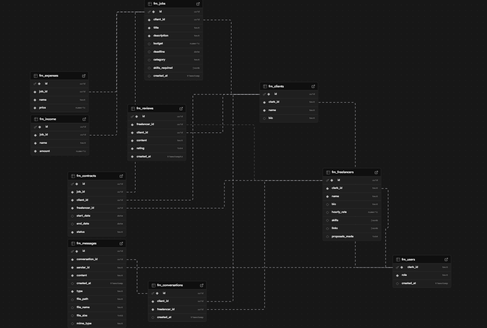

<a id="readme-top"></a>

<br />
<div align="center">
  <h1>🔵 TrueHire</h1>
  <h3>Connecting Clients & Freelancers</h3>
  <p>
    A Full-Stack Marketplace Platform built with Next.js, Stripe, AI & Real-Time Messaging
  </p>
</div>

---

<details>
  <summary>Table of Contents</summary>
  <ol>
    <li><a href="#about-the-project">About The Project</a></li>
    <li><a href="#core-features">Core Features</a></li>
    <li><a href="#user-roles">User Roles</a></li>
    <li><a href="#user-stories">User Stories</a></li>
    <li><a href="#wireframes--planning">Wireframes & Planning</a></li>
    <li><a href="#communication">Communication</a></li>
    <li><a href="#built-with">Built With</a></li>
    <li><a href="#getting-started">Getting Started</a></li>
    <li><a href="#roadmap">Roadmap</a></li>
  </ol>
</details>

---

# About The Project

**TrueHire** is a full-stack freelancer marketplace platform that connects clients with skilled freelancers.

The platform enables:

- Clients to post, edit, and manage jobs
- Freelancers to submit proposals and secure paid work
- Subscription-based freelancer accounts
- AI-powered financial assistance
- Real-time messaging between users
- Reviews and rating systems
- Advanced job and freelancer search functionality

TrueHire is designed as a scalable SaaS marketplace model combining payments, subscriptions, messaging, and AI integration into one unified system.

---

# Core Features

## Client Features

- Create, edit, and delete job postings
- View:
  - Open jobs (no freelancer assigned)
  - In-progress jobs
- Accept freelancer proposals
- Pay freelancers securely
- Send Invoices
- Leave reviews on freelancer profiles
- Search freelancers by:
  - Skills
  - Rating
  - Name
- Message freelancers directly
- Browse other job listings to understand market pricing

---

## Freelancer Features

- Create and manage profile
- Showcase:
  - Skills
  - Experience
  - Portfolio
- Submit proposals to jobs
- Track accepted and active jobs
- Receive secure payments
- Receive reviews from clients
- Subscribe for:
  - Increased monthly proposal limit
  - AI financial assistant access
- Search jobs by:
  - Skill keyword
  - Budget range
  - Client name
- Analytics:
  - Monthly Expenses/Income
  - Specific Job Expenses/Income

---

# User Roles

| Role       | Capabilities                                                 |
| ---------- | ------------------------------------------------------------ |
| Client     | Post/manage jobs, hire freelancers, pay, review              |
| Freelancer | Submit proposals, manage profile, subscribe, receive payment |

---

# User Stories

## Client User Stories

- As a client, I want to post a job so freelancers can apply.
- As a client, I want to edit or delete a job if requirements change.
- As a client, I want to review freelancers after a project is completed.
- As a client, I want to message freelancers before hiring them.
- As a client, I want to manage in-progress projects.
- As a client, I want to search freelancers by skill and rating.

## Freelancer User Stories

- As a freelancer, I want to create a professional profile.
- As a freelancer, I want to submit proposals to jobs.
- As a freelancer, I want to upgrade to a subscription for more proposal submissions.
- As a freelancer, I want an AI assistant to help track finances.
- As a freelancer, I want to search for jobs by budget or skill.
- As a freelancer, I want to receive payments securely.

---

# Wireframes & Planning

## Wireframes

Wireframes were created to define:

- Home Page
- Client Dashboard
- Freelancer Dashboard
- Job Post Page
- AI Assistant
- Messaging Interface
- Subscription Upgrade Page
- Profile Page (Freelancer)
- Charts/Analytics

## Database Planning

Include:

- Users
- Clients
- Freelancers
- Conversations
- Expenses
- Income
- Jobs
- Messages
- Reviews

# Communication

- Trello Task Allocation
- Daily progress reviews
- Git version control
- Git Branches
- Live collaboration sessions(Live Share)
- Bug Fixing

Communication Tools:

- GitHub
- VS Code Live Share
- Discord

---

# Built With

- [![Next][Next.js]][Next-url]
- [![React][React]][React-url]
- [![Clerk][Clerk]][Clerk-url]
- [![Chart.js][ChartJS]][ChartJS-url]
- [![Ably][Ably]][Ably-url]
- [![OpenAI][OpenAI]][OpenAI-url]
- [![Tailwind][Tailwind]][Tailwind-url]
- [![Supabase][Supabase]][Supabase-url]

---

# Getting Started

## Prerequisites

- Node.js
- npm
- Clerk Account
- Supabase Account
- Ably Account

---

## Installation

```bash
git clone(repo SSH)
```

Install dependencies:

```bash
npm install
```

## Environment Variables

Create a `.env.local` file in the root directory:

```
# Supabase
NEXT_PUBLIC_DATABASE_URL=
NEXT_PUBLIC_SUPABASE_URL=
SUPABASE_SERVICE_ROLE_KEY=
SUPABASE_CHAT_BUCKET=

# Clerk
NEXT_PUBLIC_CLERK_PUBLISHABLE_KEY=
CLERK_SECRET_KEY=
# Clerk - Custom Auth
NEXT_PUBLIC_CLERK_SIGN_IN_URL=/sign-in
NEXT_PUBLIC_CLERK_SIGN_IN_FALLBACK_REDIRECT_URL=/
NEXT_PUBLIC_CLERK_SIGN_UP_FORCE_REDIRECT_URL=/setup

# Ably
NEXT_PUBLIC_ABLY_API_KEY=

# AI Helper
OPENAI_API_KEY=
```

---

## Run Locally

```bash
npm run dev
```

Visit:

```
http://localhost:3000
```

---

# SQL Queries

```
CREATE TABLE fm_users (
    clerk_id TEXT PRIMARY KEY,
    role TEXT NOT NULL CHECK (role IN ('client', 'freelancer')),
    created_at TIMESTAMP DEFAULT NOW()
);
```

```
CREATE TABLE fm_clients (
    id UUID PRIMARY KEY DEFAULT gen_random_uuid(),
    clerk_id TEXT NOT NULL REFERENCES fm_users(clerk_id) ON DELETE CASCADE,
    name TEXT NOT NULL,
    bio TEXT
);
```

```
CREATE TABLE fm_freelancers (
    id UUID PRIMARY KEY DEFAULT gen_random_uuid(),
    clerk_id TEXT NOT NULL REFERENCES fm_users(clerk_id) ON DELETE CASCADE,
    subscription TEXT NOT NULL DEFAULT 'free',
    name TEXT NOT NULL,
    bio TEXT,
    hourly_rate NUMERIC,
    skills JSONB,
    links JSONB,
    job_requests_left INT DEFAULT 0
);
```

```
CREATE TABLE fm_jobs (
    id UUID PRIMARY KEY DEFAULT gen_random_uuid(),
    client_id UUID NOT NULL REFERENCES fm_clients(id) ON DELETE CASCADE,
    title TEXT NOT NULL,
    description TEXT NOT NULL,
    budget NUMERIC,
    deadline DATE,
    category TEXT,
    skills_required JSONB,
    created_at TIMESTAMP DEFAULT NOW()
);
```

```
CREATE TABLE fm_contracts (
    id UUID PRIMARY KEY DEFAULT gen_random_uuid(),
    job_id UUID NOT NULL REFERENCES fm_jobs(id) ON DELETE CASCADE,
    client_id UUID NOT NULL REFERENCES fm_clients(id) ON DELETE CASCADE,
    freelancer_id UUID NOT NULL REFERENCES fm_freelancers(id) ON DELETE CASCADE,
    start_date DATE,
    end_date DATE,
    status TEXT NOT NULL DEFAULT 'active'
);
```

```
CREATE TABLE fm_users (
    clerk_id TEXT PRIMARY KEY,
    role TEXT NOT NULL CHECK (role IN ('client', 'freelancer')),
    created_at TIMESTAMP DEFAULT NOW()
);
```

```
CREATE TABLE fm_clients (
    id UUID PRIMARY KEY DEFAULT gen_random_uuid(),
    clerk_id TEXT NOT NULL REFERENCES fm_users(clerk_id) ON DELETE CASCADE,
    name TEXT NOT NULL,
    bio TEXT
);
```

```
CREATE TABLE fm_freelancers (
    id UUID PRIMARY KEY DEFAULT gen_random_uuid(),
    clerk_id TEXT NOT NULL REFERENCES fm_users(clerk_id) ON DELETE CASCADE,
    subscription TEXT NOT NULL DEFAULT 'free',
    name TEXT NOT NULL,
    bio TEXT,
    hourly_rate NUMERIC,
    skills JSONB,
    links JSONB,
    job_requests_left INT DEFAULT 0
);
```

```
CREATE TABLE fm_jobs (
    id UUID PRIMARY KEY DEFAULT gen_random_uuid(),
    client_id UUID NOT NULL REFERENCES fm_clients(id) ON DELETE CASCADE,
    title TEXT NOT NULL,
    description TEXT NOT NULL,
    budget NUMERIC,
    deadline DATE,
    category TEXT,
    skills_required JSONB,
    created_at TIMESTAMP DEFAULT NOW()
);
```

```
CREATE TABLE fm_contracts (
    id UUID PRIMARY KEY DEFAULT gen_random_uuid(),
    job_id UUID NOT NULL REFERENCES fm_jobs(id) ON DELETE CASCADE,
    client_id UUID NOT NULL REFERENCES fm_clients(id) ON DELETE CASCADE,
    freelancer_id UUID NOT NULL REFERENCES fm_freelancers(id) ON DELETE CASCADE,
    start_date DATE,
    end_date DATE,
    status TEXT NOT NULL DEFAULT 'active'
);

```

---

# Subscription System

Freelancers can upgrade to a premium subscription which includes:

- Increased proposal submission limit
- Access to AI financial assistant
- Priority profile visibility (future feature)

Clerk handles:

- Subscription payments
- Secure checkout
- Billing management

---

# Roadmap

- [x] Authentication system
- [x] Job posting & proposal system
- [x] Messaging integration
- [x] Clerk payment integration
- [x] Subscription logic
- [x] ChartJs/Analytics
- [x] AI finance dashboard analytics
- [x] Advanced filtering algorithm
- [x] Invoices
- [ ] Escrow-style payment protection
- [ ] Deployment documentation

---

# Project Structure Overview

```
/app
  /routes
  /about
  /chat
    /[channelSlug]
  /client
    /dashboard
    /findFreelancers
      /[id]
    /findJobs
    /jobs
      /[id]
      /inprogress
      /new
  /contact
    /success
  /freelancer
    /(protected)
      /aiassistant
      /analytics
      /clients
        /[id]
      /dashboard
      /findJobs
        /[id]
      /invoices
      /jobs
        /[id]
          /expense-form
          /income-form
      /profile
        /[id]
    /plans
  /setup
  /sign-in
    /[[...sign-in]]
/components
/lib
/utils
```

---

# Future Improvements

- AI job matching system
- Middleman/Escrow Payments
- Dispute system
- Email notification system
- Chat - Read Receipts
- Chat - Typing Indicators
- Chat - Online/offline Presence
- Chat - Edit Messages
- Chat - Message Notifications
- Chat - Delete Messages
- Bookmark Jobs
- Job Alerts

---

# Reflections

- Most difficult part was the Ably Chat feature. Documentation was mixed and it took looking through a lot of different examples to get something working in the first place. After that it was a little easier making it how we wanted.
- The jobs/[id] page was quite educational. It incorporated many elements of a full stack next.js website into one page, needing 1 serving page, and 2 client pages along with database calls and a chart.
- Learning to store files in buckets through supabase buckets was educational and useful as it opens a lot of possibilities for file-sharing. This also took a while to implement it working with the chat feature.


---

# Contact

Add your contact details here.

---

<p align="right">(<a href="#readme-top">back to top</a>)</p>

<!-- MARKDOWN LINKS & IMAGES -->

## Database Schema



## Light House Scores


[Next.js]: https://img.shields.io/badge/next.js-000000?style=for-the-badge&logo=nextdotjs&logoColor=white
[Next-url]: https://nextjs.org/
[React]: https://img.shields.io/badge/React-20232A?style=for-the-badge&logo=react&logoColor=61DAFB
[React-url]: https://react.dev/
[Clerk]: https://img.shields.io/badge/Clerk-6C47FF?style=for-the-badge&logo=clerk&logoColor=white
[Clerk-url]: https://clerk.com/
[Ably]: https://img.shields.io/badge/Ably-FF5414?style=for-the-badge&logo=ably&logoColor=white
[Ably-url]: https://ably.com/
[OpenAI]: https://img.shields.io/badge/OpenAI-412991?style=for-the-badge&logo=openai&logoColor=white
[OpenAI-url]: https://openai.com/
[Tailwind]: https://img.shields.io/badge/TailwindCSS-06B6D4?style=for-the-badge&logo=tailwindcss&logoColor=white
[Tailwind-url]: https://tailwindcss.com/
[Supabase]: https://img.shields.io/badge/Supabase-3ECF8E?style=for-the-badge&logo=supabase&logoColor=white
[Supabase-url]: https://supabase.com/
[ChartJS]: https://img.shields.io/badge/Chart.js-FF6384?style=for-the-badge&logo=chartdotjs&logoColor=white
[ChartJS-url]: https://www.chartjs.org/
